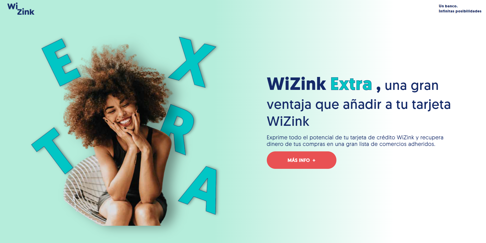

# Cheil 
## Prueba técnica Nadia Klokova diciembre/2021
----------------------------------------------

### Maquetado realizado con HTML, CSS, Layout CSS (FlexBox y Grid), JS y @media queries para definir diseño responsive.
### He usado libreria AOS (Animate On Scroll library using CSS3) para las animaciones con scroll y animaciones CSS para pagina de inicio.
#### Creo que así la pagina ha quedado clara y atractiva para los usuarios.

